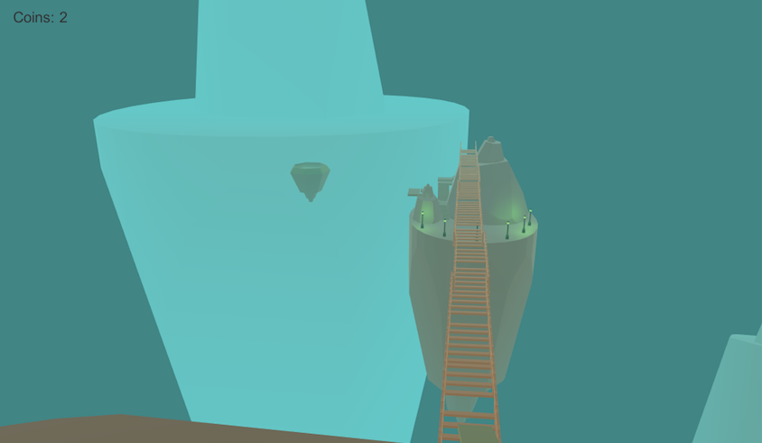
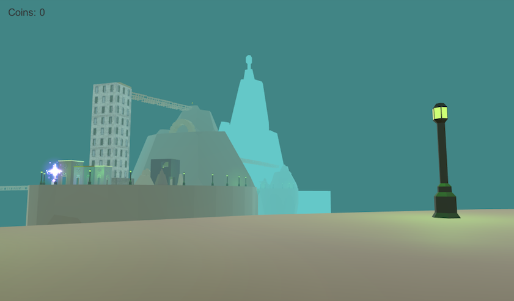
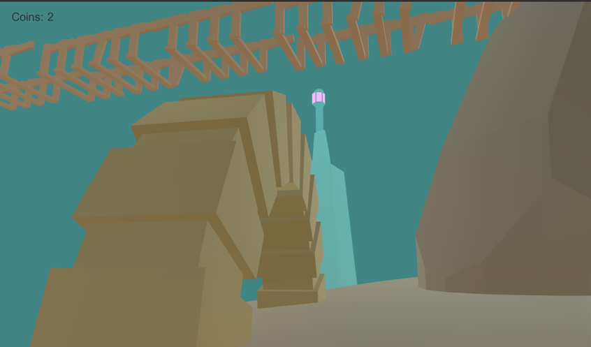
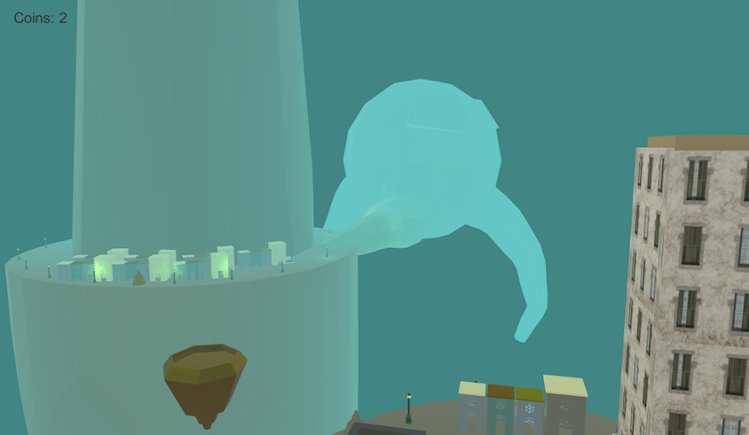

# Sky Islands First-Person Exploration Game

Sky Islands is a first-person exploration game for desktop, made in Unity. Game is developed and tested on Mac. Assets are created in Blender.

# How to Play
+ WASD / Arrows to move. Space to jump.
+ Collect the coins.
+ Don't fall into the depth.
+ Beware the skeletons.
+ Use ferry or bridges to move between sky islands. To board a ferry, jump onto it.

# Build and Run

Unity is required to open, play, and build this project. It was made with Unity 5.5.2. 

+ Install Unity 5.5.2. Unity Hub can install older editors from the [Unity download archive](https://unity.com/releases/editor/archive).
+ Open this folder as a Unity project.
+ Open `Assets/Scene/Scene1` and press Play in the editor.

To build a desktop app: File > Build Settings, choose PC, Mac & Linux Standalone, set the target platform to Mac OS X, then Build.

A Mac build is also included as `GameWorldStairs.app`.

This project is licensed under the [MIT License](LICENSE).

# Screenshots

